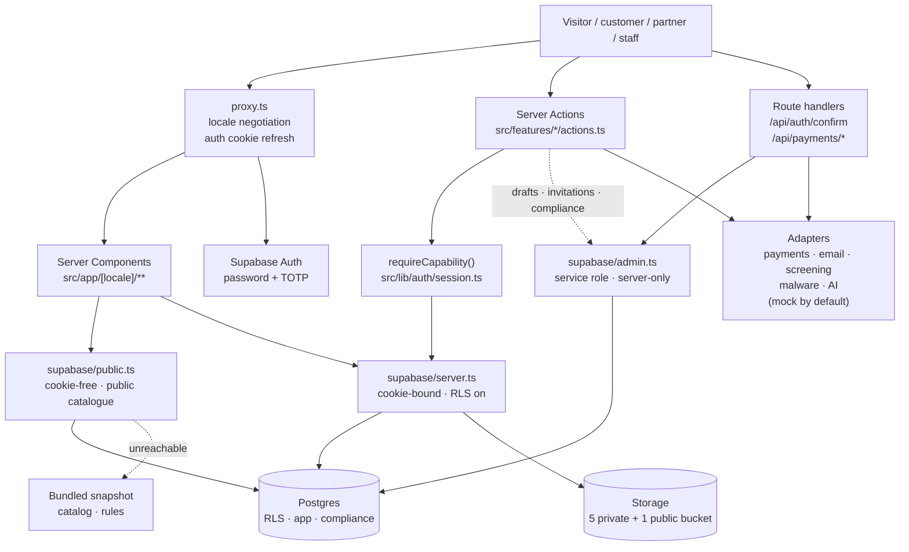
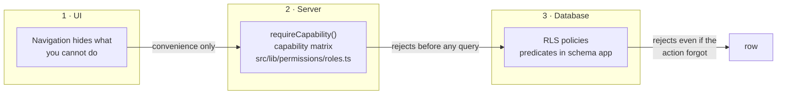
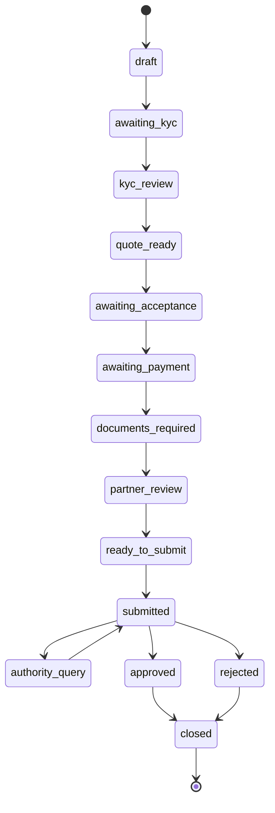

# Architecture

Diagrams for the parts of BDoor that are hard to hold in your head. The
authoritative version of everything here is the code and the migrations; this
page is a map, not a specification.

---

## Request path

Two things this diagram is trying to say:

- **`proxy.ts` does not authorise.** It negotiates the locale and refreshes the
  auth cookie. Authorisation happens in the Server Action and again in RLS.
- **`admin.ts` is a narrow door.** Service-role access is used for webhooks,
  anonymous questionnaire drafts, invitation-token lookup and the private
  `compliance` schema — nothing else.

---

## Core entities

Trimmed to the relationships that shape the product. The full schema is 81
tables across `public` and `compliance`.

```mermaid
erDiagram
    AUTH_USERS ||--|| PROFILES : "is"
    AUTH_USERS ||--o{ PLATFORM_ROLES : "may hold"
    AUTH_USERS ||--o{ ORGANIZATION_MEMBERSHIPS : "belongs through"
    ORGANIZATIONS ||--o{ ORGANIZATION_MEMBERSHIPS : has
    ORGANIZATIONS ||--o{ ORGANIZATION_INVITATIONS : issues
    ORGANIZATIONS ||--o{ CASES : owns
    ORGANIZATIONS ||--o| PARTNERS : "is, when kind = partner"

    SERVICE_CATEGORIES ||--o{ SERVICES : groups
    SERVICES ||--o{ SERVICE_REQUIREMENTS : "asks for"
    SERVICES ||--o{ SERVICE_FEE_COMPONENTS : "priced by"
    SERVICES ||--o{ CASE_SERVICES : "instantiated as"
    CASES ||--o{ CASE_SERVICES : "bundles"

    CASES ||--o{ CASE_STATUS_HISTORY : "append-only trail"
    CASES ||--o{ CASE_MILESTONES : tracks
    CASES ||--o{ CASE_PARTNER_ASSIGNMENTS : "delegated by"
    PARTNERS ||--o{ CASE_PARTNER_ASSIGNMENTS : accepts
    CASES ||--o{ DOCUMENTS : collects
    CASES ||--o{ QUOTES : "priced by"
    CASES ||--o{ MESSAGE_THREADS : discusses
    CASES ||--o| KYC_CASES : "screened by"
    CASES ||--o{ AUTHORITY_SUBMISSIONS : "filed through"
    AUTHORITY_SUBMISSIONS ||--o{ AUTHORITY_QUERIES : "answers"

    MESSAGE_THREADS ||--o{ MESSAGES : contains
    DOCUMENTS ||--o{ DOCUMENT_VERSIONS : "immutable versions"
    DOCUMENT_VERSIONS ||--o{ DOCUMENT_SCAN_RESULTS : "scanned by"
    DOCUMENTS ||--o{ DOCUMENT_ACCESS_LOGS : "every read recorded"
    DOCUMENT_RETENTION_RULES ||--o{ DOCUMENTS : "categorises"

    QUOTES ||--o{ QUOTE_VERSIONS : "revised as"
    QUOTE_VERSIONS ||--o{ QUOTE_ITEMS : "lists"
    QUOTE_VERSIONS ||--o{ ENGAGEMENT_ACCEPTANCES : "accepted by"
    QUOTES ||--o{ PAYMENTS : "settled by"
    PAYMENTS ||--o{ PAYMENT_EVENTS : "audited by"
    PAYMENTS ||--o{ RECEIPTS : "evidenced by"
    PAYMENTS ||--o{ REFUNDS : "reversed by"
    CASES ||--o{ GOVERNMENT_FEE_ADVANCES : "pass-through held in"
    GOVERNMENT_FEE_ADVANCES ||--o{ GOVERNMENT_DISBURSEMENTS : "paid out as"

    KYC_CASES ||--o{ KYC_CHECKS : "customer-visible status"
    KYC_CASES ||--o{ SCREENING_RESULTS : "detail, compliance schema"
    SCREENING_RESULTS ||--o{ RISK_FLAGS : raises
    RISK_FLAGS ||--o{ RISK_ASSESSMENTS : "rolled into"
    RISK_ASSESSMENTS ||--o{ COMPLIANCE_DECISIONS : "resolved by"

    COMPANIES ||--o{ COMPLIANCE_OBLIGATIONS : "must meet"
    COMPLIANCE_OBLIGATIONS ||--o{ COMPLIANCE_REMINDERS : "scheduled as"
    AUTH_USERS ||--o{ NOTIFICATIONS : "receives"
    CASES ||--o{ NOTIFICATIONS : "about"
```

The boundary that matters most: everything from `SCREENING_RESULTS` rightwards
lives in the private `compliance` schema. A customer sees `KYC_CASES.status` and
nothing else — not the match detail, not the risk score, not the analyst's note.

---

## Where authorisation lives

Layer 1 is convenience. Layers 2 and 3 are the enforcement, and they are
independent on purpose: a bug in either one alone does not leak data.

The RLS predicates (`app.can_read_case`, `app.is_org_member`,
`app.partner_may_see_case_documents`, …) live in the private `app` schema, are
not exposed through PostgREST, and set `search_path = ''`.

---

## Case lifecycle at a glance

Full table in [CASE-STATES.md](./CASE-STATES.md).

The waiting clock (`waiting_on`, `waiting_since`, `elapsed_days_banked`) pauses
while a case waits on the customer, on payment or on an authority, so a
turnaround estimate never counts days BDoor could not act on.

---

## Rendering strategy

| Area                                 | Strategy                     | Why                                                                              |
| ------------------------------------ | ---------------------------- | -------------------------------------------------------------------------------- |
| Marketing pages                      | static (SSG)                 | no per-request data; falls back to a bundled snapshot if Supabase is unreachable |
| `/[locale]/start`                    | dynamic                      | reads the anonymous draft cookie                                                 |
| `(customer)`, `(partner)`, `(admin)` | dynamic, `private, no-store` | per-user data, never cached, never indexed                                       |

Anything that reads cookies or headers in a shared layout forces every route
beneath it to render dynamically. That is why the marketing layout resolves
sign-in state on the client and the public catalogue uses a cookie-free Supabase
client.
