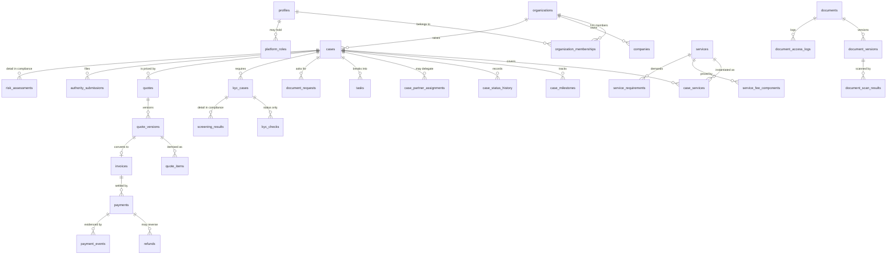

# Data model

Generated against the schema that `supabase/migrations/` actually produces, and
verified by rebuilding a throwaway database from zero
(`scripts/local-db/apply.sh --seed`) on 28 August 2026.

**Counts:** 76 tables in `public`, 5 in `compliance`, 2 views, 25 functions in
the private `app` schema. Row Level Security is enabled on all 81 tables.

Conventions: UUID primary keys (`audit_logs` uses an identity `bigint` because
it is append-only and high volume), `timestamptz` throughout, `created_at` /
`updated_at` maintained by the `app.touch_updated_at()` trigger, and money in
integer minor units.

---

## The three schemas

| Schema       | Exposure                                             | Holds                                                                       |
| ------------ | ---------------------------------------------------- | --------------------------------------------------------------------------- |
| `public`     | PostgREST Data API, RLS enforced                     | Everything a customer, partner or staff member may reach                    |
| `compliance` | **Not exposed.** No grants to `anon`/`authenticated` | Screening hits, risk analysis, compliance decisions, restricted notes       |
| `app`        | Private helper schema                                | Authorization predicates and triggers; `search_path = ''` on every function |

The split matters: a customer is entitled to know their identity check is
pending, so `public.kyc_cases` / `public.kyc_checks` carry the _status_.
Why it reached that status — screening matches, risk factors, the officer's
reasoning — lives in `compliance` and cannot be reached from the Data API at
all, whatever the UI does.

---

## Core relationships

`screening_results` and `risk_assessments` are drawn here to show the join, but
they live in `compliance` and are unreachable through the Data API.

---

## Domain groupings

**Identity and tenancy** — `profiles`, `organizations`, `organization_memberships`,
`organization_invitations`, `platform_roles`, `user_security_settings`.

Two independent role axes. `platform_roles` is BDoor staff; `organization_memberships`
is customers and partners. A person may hold both. `app.enforce_membership_role_matches_org_kind()`
stops a partner role landing on a customer organization.

**Catalogue and content** — `service_categories`, `services`, `service_requirements`,
`service_milestone_templates`, `service_fee_components`, `service_faqs`,
`content_pages`, `content_revisions`, `content_sources`.

Published rows are readable by `anon` so marketing pages stay statically
renderable. `content_revisions` is append-only.

**Intake** — `questionnaire_sessions`, `questionnaire_answers`,
`recommendation_rules`, `recommendation_results`, `leads`, `contact_requests`.

Anonymous drafts carry `anon_key_hash` and are _not_ reachable through the Data
API; server actions read them with the service role after checking the browser
cookie, so a leaked key alone cannot be replayed against PostgREST.

**Entities and people** — `companies`, `company_addresses`, `company_people`,
`ownership_links`, `beneficial_owners`, `identity_records`, `consent_records`.

`identity_records` is deliberately minimised: `identifier_last4` plus a salted
`identifier_token`, never the full number. `consent_records` is append-only.

**Cases** — `cases`, `case_services`, `case_participants`,
`case_partner_assignments`, `case_milestones`, `case_status_history`,
`case_status_transitions`, `tasks`, `task_comments`, `authority_submissions`,
`authority_queries`.

16 statuses, 39 transitions, held as _data_ in `case_status_transitions` and
enforced by `app.enforce_case_transition()`. See `docs/CASE-STATES.md`.
`case_status_history` is append-only and has a customer-safe view
(`case_status_history_public`) that simply omits `internal_note`.

**Documents** — `document_requests`, `documents`, `document_versions`,
`document_access_logs`, `document_retention_rules`, `document_scan_results`.

Paths are generated by `app.canonical_document_path()`; a client never chooses
one. `document_versions` content fields are immutable and deletion is blocked.

**Commercial** — `quotes`, `quote_versions`, `quote_items`,
`engagement_acceptances`, `invoices`, `invoice_items`, `payments`,
`payment_events`, `refunds`, `government_fee_advances`,
`government_disbursements`, `receipts`.

An accepted `quote_version` is frozen by `app.quote_versions_guard()`.
Government money is tracked separately from BDoor revenue: an advance records
`received` / `disbursed` / `refunded` and a check constraint stops it going
negative. `payment_events` is unique on `(provider, event_id)`, which is what
makes webhook replay a no-op.

**Communication and lifecycle** — `message_threads`, `messages`,
`message_reads`, `notifications`, `notification_preferences`,
`compliance_obligations`, `compliance_reminders`, `renewal_cases`.

Messaging is case-scoped by design; there is no general chat. `messages` is
append-only so a conversation reads the same way to an auditor later.

**Platform operations** — `partners`, `partner_capabilities`,
`partner_verifications`, `integration_events`, `webhook_events`, `audit_logs`,
`feature_flags`, `platform_settings`, `data_subject_requests`.

`audit_logs` and `partner_verifications` are append-only. `verified_partners_public`
exposes name, practice type and coverage only — never contact or payment details.

**Compliance (restricted)** — `screening_results`, `risk_flags`,
`risk_assessments`, `compliance_decisions`, `restricted_case_notes`.

`compliance_decisions` and `restricted_case_notes` are append-only.
`tipping_off_sensitive` marks rows that must never reach a customer or partner.

---

## Rules that must survive a refactor

- A case belongs to exactly one customer organization and may cover several services.
- A partner reaches a case only through an active assignment, and its documents
  only once `customer_authorized_at` is set — `app.partner_may_see_case_documents()`.
- An accepted quote version is immutable; a price change creates a new version.
- Append-only means append-only: `app.reject_mutation()` raises on UPDATE and
  DELETE for audit logs, case history, messages, consents, content revisions,
  engagement acceptances, partner verifications and both restricted compliance tables.
- Every table in an exposed schema has RLS enabled. Verified by
  `tests/integration/rls-storage-and-invariants.test.ts`.

---

## Divergence from the production brief

The 28 August 2026 brief proposes a larger model (`assessments`,
`entity_roles`, `quote_lines`, `idempotency_keys`, `notification_outbox`,
`audit_events`, and others). The shipped schema covers the same ground under
different names and is the source of truth here; the genuinely absent pieces
are the transactional outbox, `idempotency_keys`, `professional_credentials`,
and the retention-job tables. Those are tracked in
`docs/BUILD_REPORT.md` rather than half-declared here.

**Analytics and recurring revenue** (fundable-startup core, 30 August 2026) —
`analytics_events` (first-party commercial milestones: service-role writes
only, idempotent by key, append-only, `is_test` excluded from metrics),
`subscription_plans` / `subscriptions` / `subscription_periods` (a
subscription cannot be `active` without a verified payment or a
staff-verified offline payment — constraint-enforced), `metric_definitions`
and `metric_snapshots` (both append-only; a formula change or recomputation
is a new row). See `docs/EVENT_TAXONOMY.md` and `docs/METRIC_DEFINITIONS.md`.
